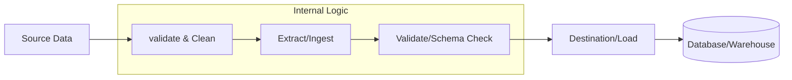

## Pipeline & Running Guidelines

The project pipeline converts raw deal text into structured deal briefs in three main steps:

1. **Input Validation & Cleaning**  
   - Raw text is checked for length (token-limited) and cleaned to remove noise.

2. **LLM Extraction & JSON Validation**  
   - The cleaned text is processed by the LLM to extract structured deal data.  
   - The output is validated against a predefined JSON schema.  

3. **Storage & Logging**  
   - Successful extractions are stored in a SQLite database.  
   - Errors (invalid JSON or other exceptions) are logged with details for review.

### Running Locally
- Backend: `cd service && uv run main.py`  
- Frontend: `cd frontend && npm start`  
- Or start everything via Docker: `docker-compose up --build`  

The pipeline can also be invoked programmatically via `run_pipeline(raw_text: str)` for integration or testing.
